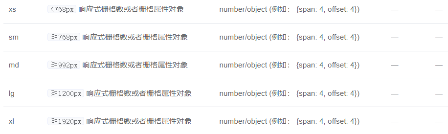
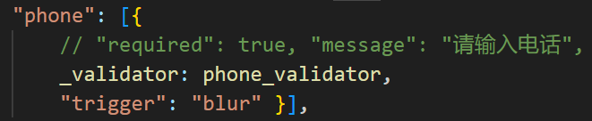
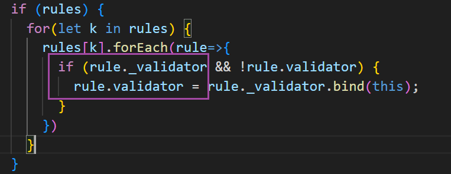

## echarts




### echarts

#### 常用api

* 库对象.init(DOM元素): 实例
* 实例.setOption(配置)， 实例.getOption();
* 实例.resize() 改变父容器大小时，自动自适应调整图表大小
* 频繁绘制的时候，调用实例.clear() 清空上一轮的数据
* 实例.dispose()销毁释放资源 
* 库对象.resgiterMap(亚洲/中国/世界);


#### 配置项

样式：通用于所有单独的个体，例如，legend、title之类的这些

legend：图例

tilie：标题

xAxis/yAxis: x、y轴线

grid：格子

visualMap：地图用的 角落中做大致的数据展示与筛选

tooltip：鼠 标提示框

series：系列[]

* 柱状图[蓝色、红色]
* 线图
* 饼图
* 地图

dataZoom：数据缩放

### 社区

[bookmarks_2023_5_18.html](bookmarks_2023_5_18.html) 

## 判断类型补充

```js

Object.prototype.toString.call({})
// '[object Object]'
Object.prototype.toString.call(new WeakMap())
// '[object WeakMap]'
function Person(){}
// undefined
Object.prototype.toString.call(new Person())
// '[object Object]'
Person.prototype[Symbol.toStringTag] = Person.name;
// 'Person'
Object.prototype.toString.call(new Person())
// '[object Person]'
// 范围太广了:obj instanceof Object
```


## 拦截器精华

1. 请求、响应、错误，三类都是按照use的顺序执行
2. 在请求拦截器中新发请求，会加入到队列中，立刻开始排队
3. 响应、错误拦截器中新发请求，会立刻发起请求
4. 响应config、响应response都会顺序获取，响应err
   4.1 如果没有写return Promise.reject(err)，后续就会作为response接收
   4.2 如果写了return Promise.reject(err)，后续作为err接收

## 第八天-FormCreator优化


* 相同函数被bind两次无效，只能被bind一次改变this


### 模块对象是持久共享的


### 课上来回切换申请贷款及首页引起的问题


* bind来的函数再次被bind是无效的，原因是因为this已经封装到代码底层,[native code]，
* 同时函数体字符串也会变成

* 导致无法eval或者创建函数


### 解决方案

* 独立开相同属性反复被 bind赋值成为底层代码



* 页面再次赋值给另一个属性（保持原来的_validator)

  ****

* 表单生成器处理的时候也避免给原属性赋值（保持原来的_validator)

  

* 其他验证器不需要this的，可以不写_，直接用validator


# 封装组件的思想

1. UI方向固定的能力，斑马纹、边框
   * 作为内部默认值（A）
   * 外部如果传递，则覆盖（A+）
   * 固定表头高度
2. 业务功能的选择
   1. 是否需要序号
   2. 多选
   3. 分页
3. 自由性的附加属性，不要阻塞


### 组件封装的优缺点

```txt
1. 比传统表格更简单（更简单）
2. 更贴合我们的业务（更适合）
3. 提高复用性
4. 减少代码冗余
5. 问题：
	5.1 不要阻断原生组件的能力attrs
	5.2 书写方式存在参数的遗漏风险
	5.3 底层原生存在的bug
	5.4. 提升或降低组件的效率
```


## 继承与混入

* 继承作为一个独立的个体来实现
* 混入，提炼代码，让各方都能复用该功能
* __继承同名函数被覆盖，混入生命周期各自执行__
  * 混入相当于组合，继承的覆写是独占


### 不阻塞原生属性或事件传递的快捷方式


* 红字标识的是vue的template中的大概用法
* 下面el-table的则是JSX中的用法


### 关于dialog，如果先销毁子组件出现先的下方突然消失的问题

```vue
 <el-dialog title="申请管理-编辑" :visible.sync="dialogVisible"
        @open="childExist = true"   
        @closed="childExist = false"
     width="50%">
      <GFormCreator v-if="childExist" :config="editForm">
     </GFormCreator>
</el-dialog>
```


## 动态标签设计思路

```txt
0、切换路由的过渡效果
1、路由切换生成tag （访问后 保存路由对象（信息多），显示名称）
2、保证created中请求，然后组件不销毁，切换时则不会发请求
3、依赖于keep-alive内置组件 实现组件缓存
```


## keep-alive切换核心


* 注意：此处push是添加作为排除触发立刻销毁，而$nextTick又取出来是为了避免和上一步合并导致无法立刻销毁


### 找文档的方法


